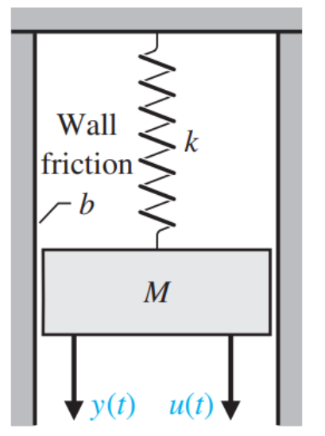
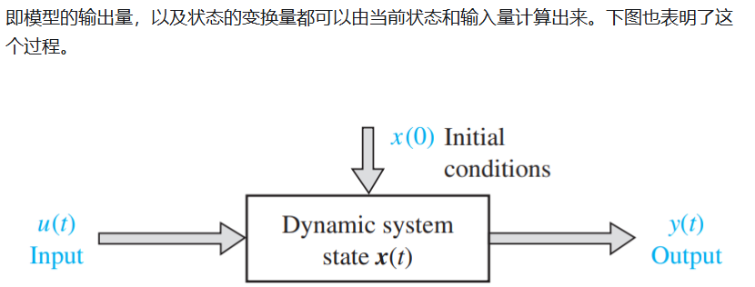
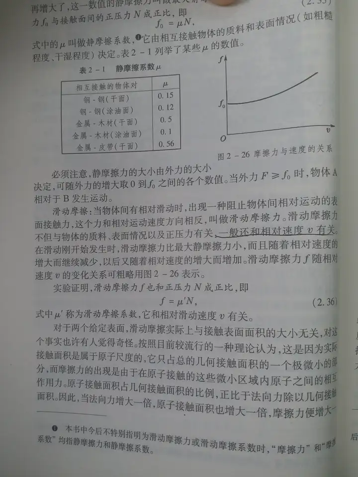

# SSM(状态空间模型)

----

author: 顾家琛
university: NUDT
email: <gujiachen21@nudt.edu.cn>
time: %%date%%time

----

## 来源：<https://zhuanlan.zhihu.com/p/684175832>

## State Space Model

> SSM是控制理论中常用的模型，在卡尔曼滤波、隐马尔可夫模型都有应用。它是利用了一个中间的状态变量，使得其他变量都与状态变量和输入线性相关，极大的简化问题。
> 首先举一个通俗的例子。假设我现在知道了小王的学历、专业能力、社交能力、工作时间的变化作为输入  ，预测他当前收入  。一方面我们可以直接去看u(t)和y(t)的关系，但这往往是较复杂的；另一方面，我们可以构造一些状态变量X，例如小问题解决能力、执行能力、可改造度等一些比较抽象的指标这些指标往往和输出线性相关，于是可以先计算状态变量，得到最终的输出。

当我们给定一个力u(t) 作为系统的输入，求物体M的位移y(t) 作为系统的输出。

推导：(值得注意的是，滑动摩擦力与物体运动速度相关: <https://www.zhihu.com/question/270655565?sort=created> [^1])

1. $Ma = u(t) - bv - ky(t)$ （其中a是加速度， v是速度）
2. $M\frac{d^2y(t)}{dt^2} = u(t) - b\frac{dy(t)}{dt} - ky(t)$
3. 构建状态向量 $\mathit{X} = \begin{bmatrix} x_1(t)\\x_2(t)\end{bmatrix} = \begin{bmatrix} y(t)\\\frac{d_y(t)}{dt}\end{bmatrix}$
4. $\mathit{X^{'}} = \begin{bmatrix} x_1^{'}(t)\\x_2^{'}(t)\end{bmatrix} = \begin{bmatrix} x_2^{'}(t)\\\frac{u(t)-bx_2(t)-kx_1(t)}{M}\end{bmatrix}$
5. 即 $\mathit{X^{'}} = \begin{bmatrix} 0&1\\-\frac{k}{M}&-\frac{b}{M}\end{bmatrix} \begin{bmatrix} x_1\\x_2\end{bmatrix} + \begin{bmatrix} 0\\\frac{1}{M}\end{bmatrix} u(t)$
6. 一般来说有如下两种方程
   1. $\mathit{X^{'}} = AX + Bu$
   2. $y = CX + Du$

## 离散化

此部分详情请看[离散化方法](离散化方法.md)

### 欧拉法

由$\mathit{x^{'}} = \frac{x_{k+1} - x_k}{T}$可得
$\mathit{x^{'}} = Ax_k + Bu_k$
$x_{k+1} - x_k = T[Ax_k + Bu_k]$
$x_{k+1} = (I + TA)x_k + TBu_k$
$y = Cx + Du$

### 零阶保持法（Mamba）

### 双线性变换

[^1]: 
