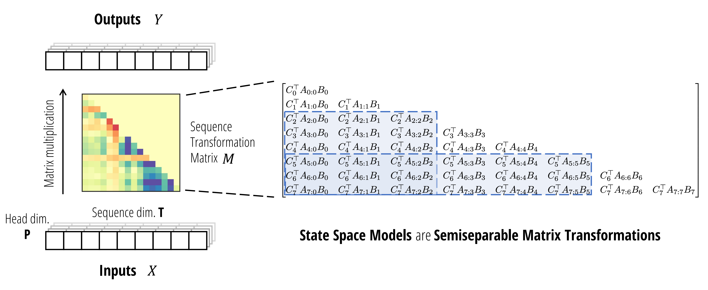
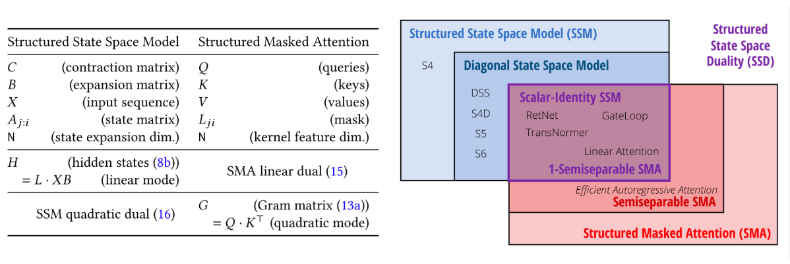
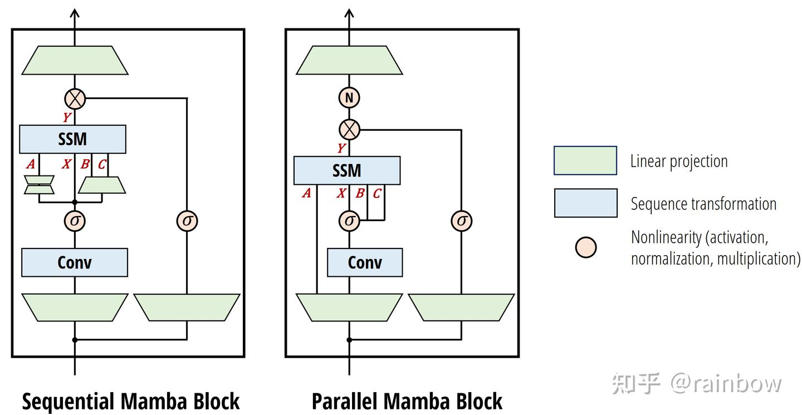

# mamba2详解

----

author: 顾家琛
university: NUDT
email: <gujiachen21@nudt.edu.cn>
time: %%date%%time

----

## 核心公式（SSD）

$$h_t = A_th_{t-1} + B_tx_t \tag{1-1}$$
$$y_t = C_t^Ty_t \tag{1-2}$$
$$T^{(T,P)} = SSM(A^{T},B^{(T,N)},C^{(T,N)})(X^{(T,P)})$$

SSD的对偶注意力：
$$M = L * CB^T$$

## 一、背景知识

### 1. mamba1的问题：没有办法高效的使用矩阵乘法


它只能在递归模式下计算，而不是卷积模式，并且需要“专门的硬件感知实现”才能高效，即如下图所示


即便如此，它仍然不如硬件友好的模型(如 CNN 和 Transformer)高效，因为它没有利用矩阵乘法单元，而现代加速器(如 GPU 和 TPU)正是为此而专门设计的

总之，虽然时间不变SSM 与连续、递归和卷积序列模型密切相关，但它们与注意力机制没有直接关系。所以mamba2想揭示选择性SSM和注意力机制之间的更深层次关系，并利用这一点显著提高SSM的训练速度，同时允许更大的状态规模N。

### 2. 结构化SSM的序列变换：三个定义

#### 定义2.1：序列变换是指$Y = f_{\theta}(X)$

其中$X,Y \in \mathbb{R}^{T,P} $，$\theta $代表任意参数集合。
T代表序列维度或者时间维度，可以作为下标访问得到$X_t, Y_t \in \mathbb{R}^P $，P是向量维度。

#### 定义2.2：$SSM(A,B,C) = SSM(A_{0:T},B_{0:T},C_{0:T}) $，作为序列变换

#### 定义2.3：矩阵变换：指一个序列变换$Y = f_{\theta}(X)$ 可以写成形式$Y = M_{\theta}X $

### 3. 其他定义

#### 3.1：线性注意力

经典自注意力机制如下。

$$
Y = softmax(QK^T)V
$$

线性注意力将softmax折叠到核特征映射中，并利用矩阵乘法的结合性将注意力计算的矩阵左乘改为右乘。

$$
(QK^T)\cdot V = Q\cdot (K^T V)
$$


线性Transformer是RNN，SSM也是RNN。那么mamba和SSM的联系为：

- 因果掩码合并为
\label{
$$
\begin{equation}
L \circ QK^T \cdot V
\end{equation}
$$
}{eq 1}

，其中\(L\)是下三角全1矩阵

#### 3.2：结构化矩阵定义

结构化矩阵是指:

1. 可以压缩表示，在亚二次（理想情况下是线性）参数中表示；
2. 并且可以通过快速算法，直接操作这这种压缩表示。

#### 3.3：SSD（结构化空间对偶）

应用SSM作为标准计算，SSD有两个不同点：

1. A简化为标量乘单位矩阵。
2. 使用更大的头维度P，相比于mamba1中P=1，通常使用\(P = \{64, 128\}\)

#### 4. 论文结构


## 二、SSD的由来

### 2.1 SSM是结构化矩阵(State Space Models are Structured Matrices)

首先根据定义有\(h_0 = B_0x_0\)，并且\(\prod_i^{i-1} = 1\)，可知
$h_t = A_t \dots A_1B_0x_0 + \cdots + A_tB_{t-1}x_{t-1} + B_tx_t \\ = \sum_{s=0}^{t} \prod_{i=s+1}^{t}A_{i} B_sx_s $

然后有
\label{
$$
\begin{equation}
\begin{aligned}
y_t &= \sum_{s=0}^{t} C_t^T \prod_{i=s+1}^{t}A_{i} B_sx_s \\
&= SSM(A, B, C)(x) = Mx \\
M_{ij} := C_i^T \prod_{k=j+1}^{i} A_{k} B_j
\end{aligned}
\end{equation}
$$
}{eq 2}

### 2.2 半可分矩阵

#### 定义：3.1 若一个（下三角）矩阵 𝑀 的所有位于下三角部分（即对角线及其以下区域）的子矩阵的秩均不超过 N，则称 𝑀 为 N-半可分矩阵（N-semiseparable matrix），其中 N 称为该半可分矩阵的阶或秩

#### 定义：3.2 顺序半可分表示（The Sequentially Semiseparable, SSS），每个N-半可分矩阵都有一个N-SSS表示

一个下三角矩阵\(M \in R^{T,T} \)，如果它可以写成以下形式，则具有N-SSS表示。

$$
M_{ij} = C_i^T \prod_{k=j+1}^{i} A_{k} B_j
$$

#### 定义：3.3 一个 N-SSS 矩阵 𝑀具有上面3.2公式的表示，则便是 N-半可分的

证明如下。

考虑任何非对角块$M_{i:{i'}, j:j'} $，并且其中${i'}>i\ge j'>j $，具有显式的秩分解如下。

\label{
$$
\begin{equation}
\begin{bmatrix}
C_i^T \prod_{k=j+1}^{i} A_{k} B_j&\cdots &C_i^T \prod_{k=j'+1}^{i} A_{k} B_{j'}\\
\vdots&\quad&\vdots\\
C_{i'}^T \prod_{k=j+1}^{i'} A_{k} B_j&\cdots&C_{i'}^T \prod_{k=j'+1}^{i'} A_{k} B_{j'}
\end{bmatrix} =
\begin{bmatrix}
C_i^T \prod_{k=i}^{i} A_{k}\\
\vdots\\
C_{i'}^T \prod_{k=i}^{i'} A_{k}
\end{bmatrix} \prod_{k=j'+1}^{i-1} A_{k}
\begin{bmatrix}
\prod_{k=j+1}^{j'} A_{k}B_j&\cdots&B_{j'}
\end{bmatrix}
\end{equation}
$$
}{eq 3}

#### 1-半可分矩阵(标量SSM递归)

当\(C_j\)和\(B_i\)均为标量时

$$
SSS(A, B, C) = diag(A) \cdot M diag(B)
$$

#### 定义：3.4 SSM的序列变换

$$
SSM(A, B, C) = SSM(A_{0:T}, B_{0:T}, C_{0:T})
$$
(序列变换$X\in \mathbb{R}^{T,P} \rightarrow Y \in \mathbb{R}^{T, P} $)
与SSS(矩阵构造算子)一致



1. 作为序列变换，SSM可以表示为作用于序列维度T上的矩阵变换𝑀∈R(T,T)，在一个头的每个通道中共享相同的矩阵(如上图左侧所示)
2. 这个矩阵是一个半可分矩阵(如上图右侧所示)，它是一个秩结构矩阵，其中包含在对角线及其以下的每个子矩阵(蓝色)的秩最多为N，等于SSM的状态维度。

### 2.3 通过结构化矩阵乘法计算SSM

半可分矩阵(即秩结构矩阵)是一种经典的结构化矩阵类型：

1. 它们具有压缩表示形式，例如SSS形式只有O(T)参数，而不是\(O\left(\mathrm{~T}^{2}\right)\)参数
2. 它们有直接在压缩表示上操作的快速算法

#### 定义；3.5 一个N-SS矩阵秩为T，可以用O(NT)参数表示，并且矩阵向量乘法时空复杂度为O(NT)

例如， 1-SS矩阵有

$$
\begin{aligned}
y_t &= \sum_{i=0}^{t} c_i b_i \prod_{k=i+1}^{t} A_{k} x_i \\
&= \sum_{i=0}^{t-1} c_i b_i \prod_{k=i+1}^{t} A_{k} x_i + c_tb_tx_t \\
&= a_t\sum_{i=0}^{t-1} c_i b_i \prod_{k=i+1}^{t-1} A_{k} x_i + c_tb_tx_t \\
&= a_t y_{t-1} + c_tb_tx_t
\end{aligned}
$$

因此计算\(Y \in \mathbb{R}^{T,1} \)需要\(T * O(N)\)


### 2.4 SMA(结构化掩码注意力)：可实例化为任何给定的矩阵结构类别

注意\ref{eq 1}，线性注意力的关键在于\(L\)，其等同于累加求和运算。

事实上，\(L\)可以是任何结构化矩阵，特别是，我们可以使用任何矩阵-向量乘法复杂度低于二次方(理想情况下是线性)的掩码矩阵L。

#### 定义：3.6 结构化掩码注意力SMA(或简称结构化注意力)被定义为一个函数作用于查询/键/值𝑄, 𝐾, 𝑉以及任何结构化矩阵 𝐿 (即具有低于二次复杂度的矩阵乘法—— sub-quadratic matrix multiplication)，通过四维张量收缩

$$
Y = contract(TN, SN, SP, TS \in TP)(Q, K, V, L)
$$

SMA二次模式算法，对应于注意力计算

$$
\begin{equation}
\begin{aligned}
G &= contract(TN, SN \in TS)(Q, K) \\
M &= contract(TS, TS \in TS)(G, L) \\
Y &= contract(TS, SP \in TP)(M, V)
\end{aligned}
\end{equation}
$$

SMA线性模式算法，对应于线性注意力的计算顺序

$$
\begin{equation}
\begin{aligned}
Z &= contract(SP, SN \in SPN)(V, K) \\
H &= contract(TS, SPN \in TPN)(L, Z) \\
Y &= contract(TN, TPN \in TP)(Q, H)
\end{aligned}
\end{equation}
$$

通过改变\(L\)，可以将SMA实例化为给定的任意给定的矩阵结构，如图所示。


## 三、硬件高效的SSD算法与Mamba2架构

### 3.1 硬件高效的SSD算法：块分解、对角块、低秩块

#### 定义 6.1：考虑一个具有状态扩展因子\(N\)和头部维度\(P = N\)的SSD模型，存在一种算法可以再任何输入\(X \in \mathcal{R}^{(T,P)}\)上计算模型，该算法只需要\(O(TN^2)\)训练FLOPS，\(O(TN)\)推理FLOPS，\(O(N^2)\)推理内存



#### 块分解

将矩阵划分为一个\(\dfrac{T}{Q} \times \dfrac{T}{Q}\)的子矩阵网格，每个子矩阵大小为\(Q \times Q\)。非对角块是低秩的。

有如下划分

$$
\left[
\begin{array}{ccc|ccc|ccc}
C_0^TA_{0:0}B_0\\
C_1^TA_{1:0}B_0&C_1^TA_{1:1}B_1\\
C_2^TA_{2:0}B_0&C_2^TA_{2:1}B_1&C_2^TA_{2:2}B_2\\
\hline
C_3^TA_{3:0}B_0&C_3^TA_{3:1}B_1&C_3^TA_{3:2}B_2&C_3^TA_{3:3}B_3\\
C_4^TA_{4:0}B_0&C_4^TA_{4:1}B_1&C_4^TA_{4:2}B_2&C_4^TA_{4:3}B_3&C_4^TA_{4:4}B_4\\
C_5^TA_{5:0}B_0&C_5^TA_{5:1}B_1&C_5^TA_{5:2}B_2&C_5^TA_{5:3}B_3&C_5^TA_{5:4}B_4&C_5^TA_{5:5}B_5\\
\hline
C_6^TA_{6:0}B_0&C_6^TA_{6:1}B_1&C_6^TA_{6:2}B_2&C_6^TA_{6:3}B_3&C_6^TA_{6:4}B_4&C_6^TA_{6:5}B_5&C_6^TA_{6:6}B_6\\
C_7^TA_{7:0}B_0&C_7^TA_{7:1}B_1&C_7^TA_{7:2}B_2&C_7^TA_{7:3}B_3&C_7^TA_{7:4}B_4&C_7^TA_{7:5}B_5&C_7^TA_{7:6}B_6&C_7^TA_{7:7}B_7\\
C_8^TA_{8:0}B_0&C_8^TA_{8:1}B_1&C_8^TA_{8:2}B_2&C_8^TA_{8:3}B_3&C_8^TA_{8:4}B_4&C_8^TA_{8:5}B_5&C_8^TA_{8:6}B_6&C_8^TA_{8:7}B_7&C_8^TA_{8:8}B_8
\end{array}
\right]
$$

定义\(A_{0:0} = 1, A_{i:j} = \prod_{k=j+1}^{i} A_k\)

进而有

\label{
$$
\left[
\begin{array}{c|c|c}
\begin{array}{ccc}
C_0^TA_{0:0}B_0\\
C_1^TA_{1:0}B_0&C_1^TA_{1:1}B_1\\
C_2^TA_{2:0}B_0&C_2^TA_{2:1}B_1&C_2^TA_{2:2}B_2
\end{array}
\\
\hline
\fcolorbox{black}{#CCDCF7}{$
\begin{array}{ccc}
\begin{bmatrix}
C_3^TA_{3:2}\\
C_4^TA_{4:2}\\
C_5^TA_{5:2}
\end{bmatrix}
&A_{2:2}&
\begin{bmatrix}
B_0^TA_{2:0}\\
B_1^TA_{2:1}\\
B_2^TA_{2:2}
\end{bmatrix}^T
\end{array}
$}
&
\begin{array}{ccc}
C_3^TA_{3:3}B_3\\
C_4^TA_{4:3}B_3&C_4^TA_{4:4}B_4\\
C_5^TA_{5:3}B_3&C_5^TA_{5:4}B_4&C_5^TA_{5:5}B_5
\end{array}
\\
\hline
\fcolorbox{black}{#CCDCF7}{$
\begin{array}{ccc}
\begin{bmatrix}
C_6^TA_{6:5}\\
C_7^TA_{7:5}\\
C_8^TA_{8:5}
\end{bmatrix}
&A_{5:2}&
\begin{bmatrix}
B_0^TA_{2:0}\\
B_1^TA_{2:1}\\
B_2^TA_{2:2}
\end{bmatrix}^T
\end{array}
$}
&
\fcolorbox{black}{#CCDCF7}{$
\begin{array}{ccc}
\begin{bmatrix}
C_6^TA_{6:5}\\
C_7^TA_{7:5}\\
C_8^TA_{8:5}
\end{bmatrix}
&A_{5:5}&
\begin{bmatrix}
B_3^TA_{5:3}\\
B_4^TA_{5:4}\\
B_5^TA_{5:5}
\end{bmatrix}^T
\end{array}
$}
&
\begin{array}{ccc}
C_6^TA_{6:6}B_6\\
C_7^TA_{7:6}B_6&C_7^TA_{7:7}B_7\\
C_8^TA_{8:6}B_6&C_8^TA_{8:7}B_7&C_8^TA_{8:8}B_8
\end{array}
\end{array}
\right] \tag{4}
$$
}{eq 4}

下面是朴素实现。

```python
def segsum(x):
"""朴素的段和计算。exp(segsum(A)) 生成一个 1-SS 矩阵，等价于一个标量 SSM """
T = x.size(-1)
x_cumsum = torch.cumsum(x, dim=-1)
x_segsum = x_cumsum[..., :, None] - x_cumsum[..., None, :]
mask = torch.tril(torch.ones(T, T, device=x.device, dtype=bool), diagonal=0)
x_segsum = x_segsum.masked_fill(~mask, -torch.inf)
return x_segsum
 
def ssd(X, A, B, C, block_len=64, initial_states=None): 
"""
Arguments:
X: (batch, length, n_heads, d_head)
A: (batch, length, n_heads)
B: (batch, length, n_heads, d_state)
C: (batch, length, n_heads, d_state)
Return:
Y: (batch, length, n_heads, d_head)
"""
assert X.dtype == A.dtype == B.dtype == C.dtype
assert X.shape[1] % block_len == 0
 
# 重新排列成块/段
X, A, B, C = [rearrange(x, "b (c l) ... -> b c l ...", l=block_len) for x in (X, A, B, C)]
A = rearrange(A, "b c l h -> b h c l")
A_cumsum = torch.cumsum(A, dim=-1)
```

#### 3.1.1 segsum计算1-SS矩阵

1-SS中每个元素是累乘的，但是数字可能会极小，因此采用segsum操作。
即通过\(\log\)和\(\exp\)操作。

初始操作中累加和处理为：

```python
x_cumsum = torch.cumsum(x, dim=-1)
x_segsum = x_cumsum[..., :, None] - x_cumsum[..., None, :]
```

由于SSM对数值十分敏感，这个操作需要做减法操作，这就会引入[Catastrophic_cancellation](http://www.shuxueji.com/w/81877)问题，简单来说，两个大的数值十分接近，相对差值很小；但是他们减去同一个数后，变成小的数值了，相对差值就变大了。

所以改进成了无减法的版本：

```python
x = repeat(x, "... d -> ... d e", e=T)
mask = torch.tril(torch.ones(T, T, device=x.device, dtype=bool), diagonal=-1)
x = x.masked_fill(~mask, 0)
x_segsum = torch.cumsum(x, dim=-2)
```

根据作者的介绍，这个细节非常重要，如果是unstable版本的实现，可能用fp32训练刚开始没多久就出现了nan。

#### 3.1.2 计算对角块

采用与$Y = (L \circ CB^T )X$同样的计算方法。

```python
 # 1. Compute the output for each intra-chunk (diagonal blocks)
L = torch.exp(segsum(A))
Y_diag  = torch.einsum("bclhn,bcshn,bhcls,bcshp->bclhp", C, B, L, X)  ## orange
```
#### 3.1.3 低秩分解计算

如公式 \ref{eq 4}，具体而言即是计算

$$
\fcolorbox{black}{#CCDCF7}{$
\begin{array}{ccc}
\begin{bmatrix}
C_6^TA_{6:5}\\
C_7^TA_{7:5}\\
C_8^TA_{8:5}
\end{bmatrix}
&A_{5:2}&
\begin{bmatrix}
B_0^TA_{2:0}\\
B_1^TA_{2:1}\\
B_2^TA_{2:2}
\end{bmatrix}^T
\end{array}
$}
$$
> 计算右因子

```python
# 2. Compute the state for each intra-chunk
# (right term of low-rank factorization of off-diagonal blocks; B terms)
decay_states = torch.exp((A_cumsum[:, :, :, -1:] - A_cumsum))
states = torch.einsum("bclhn,bhcl,bclhp->bchpn", B, decay_states, X)
```

其中\(A\_cmsum\)是A每个块在l维度上的累计和。

> 计算中心因子

```python
# 3. Compute the inter-chunk SSM recurrence; produces correct SSM states at chunk boundaries
    # (middle term of factorization of off-diag blocks; A terms)
    if initial_states is None:
        initial_states = torch.zeros_like(states[:, :1])
    states = torch.cat([initial_states, states], dim=1)
    decay_chunk = torch.exp(segsum(F.pad(A_cumsum[:, :, :, -1], (1, 0))))
    new_states = torch.einsum("bhzc,bchpn->bzhpn", decay_chunk, states)
    states, final_state = new_states[:, :-1], new_states[:, -1]
```

> 计算左因子

```python
# 4. Compute state -> output conversion per chunk
# (left term of low-rank factorization of off-diagonal blocks; C terms)
state_decay_out = torch.exp(A_cumsum)
Y_off = torch.einsum('bclhn,bchpn,bhcl->bclhp', C, states, state_decay_out)
```

> 综合所有计算结果

```python
# Add output of intra-chunk and inter-chunk terms (diagonal and off-diagonal blocks)
Y = rearrange(Y_diag+Y_off, "b c l h p -> b (c l) h p")
```

### 3.2 计算复杂度分析

将符号\(BMM(B, M, N, K)\)定义为一个批量矩阵乘法\(contract(MK, KN → MN)\)，其中批次（batch）维度为 B。从这个符号我们可以推断出计算的三个方面的效率：

- 计算成本：总共\( O(BMNK)\quad FLOPs\)。
- 内存成本：总共\( O(B(MK+KN+MN)) \)空间。
- 并行化：较大的\( M、N、K \)项可以利用现代加速器上的专门矩阵乘法单元。

#### 3.2.1 中心块

计算核矩阵 \(C^TB\)，其成本为\( BMM(T/Q, Q, Q, N)\)。
乘以掩码矩阵，这是一个形状为$ (T/Q, Q, Q) $的张量的逐元素操作。
乘以X值，其成本为\( BMM(T/Q, Q, P, N)\)。

#### 3.2.2 低秩块：右因子

这一步是一次矩阵乘法，成本为\( BMM(T/Q, N, P, Q)\)。

#### 3.2.3 低秩块：中心因子

这一步是一个标量 SSM 扫描（或 1-SS 乘法），长度为 T/Q，独立通道为 (N, P)。这个扫描的工作量为 TNP/Q，与其他因素相比可以忽略不计。

需要注意的是，由于分块将序列长度从 T 减小到 T/Q，这个扫描的成本比纯 SSM 扫描（例如 Mamba 的选择扫描）小了 Q 倍。因此我们可以观察到，在大多数问题长度上，其他算法可能更有效，或者更容易实现而不会显著减慢速度。例如，通过 1-SS 矩阵乘法的朴素实现成本为 BMM(1, T/Q, NP, T/Q)，这比朴素的递归/扫描实现更容易，并且可能比其更有效。

#### 3.2.4 低秩块：左因子

这一步是一次矩阵乘法，成本为 BMM(T/Q, Q, P, N)。

#### 3.2.5 总成本

如果我们设置 N=P=Q（换句话说，状态维度、头维度和块长度相等），那么上述所有 BMM 项都变成了 BMM(T/N, N, N, N)。其计算特性是：

总 FLOP 数量为 \(O(TN^2)\)。
总内存为 \(O(TN)\)。
工作主要由形状为 (N,N) 的矩阵乘法组成。

与Attention和mamba1相比


### 3.3 mamba2 架构



1. Mamba-1 受 SSM 为中心的观点启发，其中选择性 SSM 层被视为从 $ X \rightarrow Y $ 的映射。SSM 参数 $ A $，$ B $，$ C $ 被视为附属参数，并且是 SSM 输入 $ X $ 的函数。因此，定义 $ (A, B, C) $ 的线性投影发生在创建 $ X $ 之后，从左侧的 sequential mamba block 可以看出，$ (A, B, C) $ 在在 SSM 之前还有一个参数投影。

2. 在 Mamba-2 中，SSD 层被视为从 $ A $，$ X $，$ B $，$ C \rightarrow Y $ 的映射。因此，可以通过单个投影并行产生 $ A $，$ X $，$ B $，$ C $ 。这类似于标准注意力架构，其中 $ X $，$ B $，$ C $ 对应于并行创建的 $ Q $，$ K $，$ V $ 投影。从右侧图可以看出，只需要最开始的投影即可，SSM 之前不需要额外的投影了。

3. 带来的好处：采用并行投影以获得 SSM 的 $ A $，$ B $，$ C $，$ X $ 输入减少了参数，并且我们可以通过 Megatron 的 sharding pattern 实现张量并行。

4. SSM参数𝐴, 𝐵, 𝐶在模块开始时生成，而不是作为SSM输入𝑋 的函数

> the SSM parameters 𝐴, 𝐵, 𝐶 are produced at the beginning of the block instead of as a function of the SSM input 𝑋 .

5. 添加了一个额外的归一化层，如NormFormer，提高了稳定性

> An additional normalization layer is added as in NormFormer(Shleifer, Weston, and Ott 2021), improving stability.

6. 𝐵和𝐶投影只有一个头部，在𝑋头部之间共享，类似于多值注意力（MVA）

> The 𝐵 and 𝐶 projections only have a single head shared across the 𝑋 heads, analogous to multi-value attention (MVA)

### 3.4 额外的归一化

在初步实验中，发现较大模型中容易出现不稳定性

通过在最终输出投影之前的块中添加一个额外的归一化层(例如LayerNorm、GroupNorm或RMSNorm)来缓解这一问题。 这种归一化的使用与NormFormer架构最直接相关，该架构也在MLP和MHA块的末端添加了归一化层。


