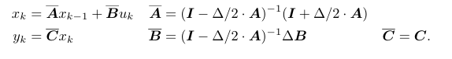
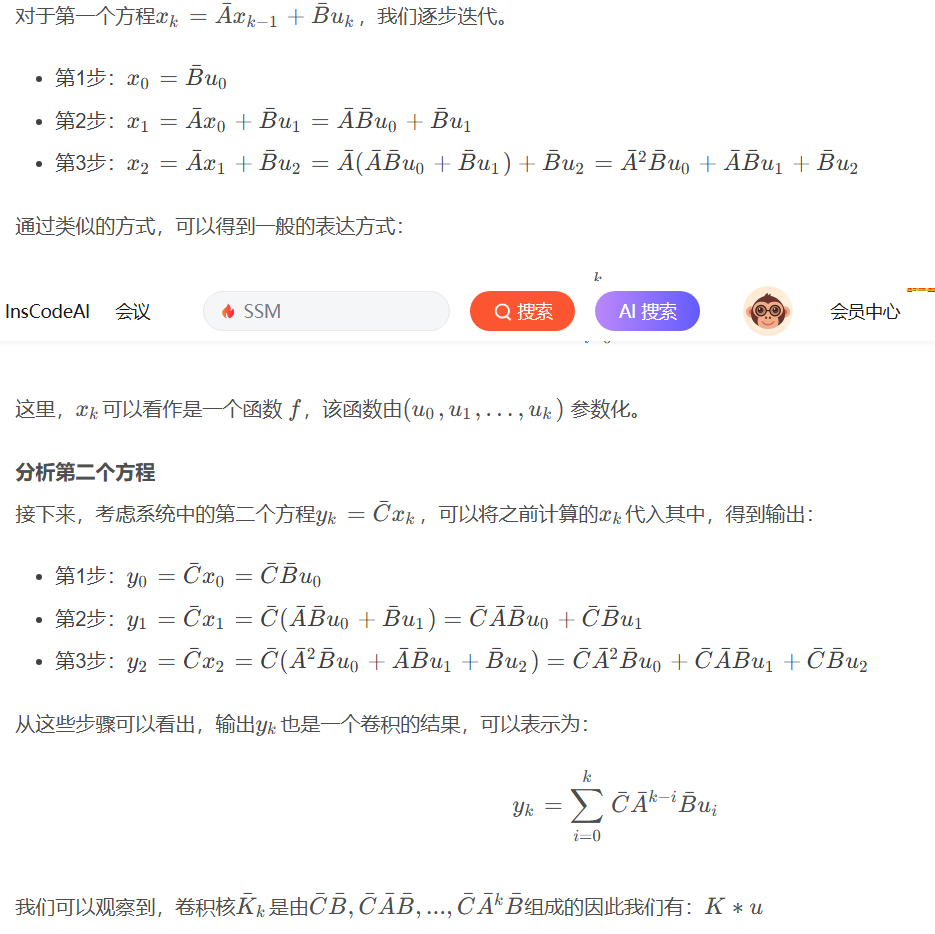

# S4阅读

----

author: 顾家琛
university: NUDT
email: <gujiachen21@nudt.edu.cn>
time: %%date%%time

----

## Effciently Modeling Long Sequences with Structured State Spaces

## 一、摘要

1. 尽管传统的模型（如 RNN、CNN 和 Transformer）都有专门用于捕捉长距离依赖的变体，但它们在扩展到长度为 10,000 步甚至更长的序列时仍面临困难
2. 使用SSM建模序列空间：

$$x^{'}(t) = Ax(t) + Bu(t)$$
$$y(t) = Cx(t) + Du(t)$$

其中，\(x(t) \in \mathbb{R}^{N*1},\quad y(t)\quad and\quad u(t) \in \mathbb{R}\)
\(A \in \mathbb{R}^{N*N},B \in \mathbb{R}^{N*1},C \in \mathbb{R}^{1*N},D \in \mathbb{R} \)

3. S4的优点：
   - 可以轻松应对长文本
   - 可以在连续时间模型、卷积模型和循环模型之间灵活转换

## 二、背景知识（状态空间）

### 2.1 State Space Models: A Continuous-time State Model

状态空间定义如\ref{eq 1}。

\label{
$$\begin{equation}
\begin{aligned}
a &= b + c \\
d &= e + f \\
g &= h + i
\end{aligned}
\end{equation}$$
}{eq 1}

### 2.2 Addressing Long-Range Dependencies with HIPPO

先前的SSM应用较差，可能是因为线性一阶常微分方程的解是指数函数，因此在序列长度较长时，梯度可能会呈指数级增长或衰减（即存在梯度消失/爆炸问题）。

HiPPO提出了一类特殊矩阵\ref{eq 2}，状态 ***x(t)*** 可以有效记忆输入 ***u(t)***

\label{
$$\begin{equation}
(HiPPO\quad Matrix)  A_{nk} = -
\begin{cases}
\sqrt{(2n + 1)(2k + 1)} & \text{if } n > k \\
n + 1 & \text{if } n = k \\
0 & \text{if } n < k
\end{cases}
\end{equation}$$
}{eq 2}

### 2.3 Discrete-time SSM: The Recurrent Representation(离散时间 SSM：递归表示)

#### 双线性变换: 将z平面映射到s平面

在原点sT/2=0处进行泰勒展开，并砍去高阶项，很容易得到
$z = e^{sT} = \frac{e^{sT/2}}{e^{-sT/2}} \approx \frac{1+sT/2}{1-sT/2}$
进而可得
$s = \frac{2}{T}\frac{1-z^{-1}}{1+z^{-1}}$
接下来将$\textit{z} = e^{jw}$带入
$$\begin{align*}
\textit{s} &= \frac{2}{T}\frac{1-e^{-jw}}{1+e^{jw}} \\
&=\frac{2}{T}\frac{e^{jw/2}-e^{-jw/2}}{e^{jw/2}+e^{-jw/2}} \\
&=\mathit{j}\frac{2}{T}\frac{\mathit{sin(w/2)}}{\mathit{cos(w/2)}} \\
&=\mathit{j}\frac{2}{T}\mathit{tan(w/2)}
\end{align*}$$

#### SSM离散化

原式状态方程
$$
\begin{align}
x'(t) &= Ax(t) + Bu(t)\\
y(t) &= Cx(t) + Du(t)
\end{align}
$$

下面对公式（3）进行推导。

先进行拉式变换得到
$\mathcal{L}[x'(t)] = A\mathcal{L}[x(t)] + B\mathcal{L}[u(t)]$
化简得到
$sX(s) - X(0) = AX(s) + BU(s)$
其中\(X(0) = 0\)，则
$sX(s) = AX(s) + BU(s)$
接下来应用双线性变换，即代入\(s = \frac{2}{T}\frac{1-z^{-1}}{1+z^{-1}}\)，并移项化简得到
$zX(z) = (I-\frac{T}{2}A)^{-1}(I + \frac{T}{2}A)X(z) + (I-\frac{T}{2}A)^{-1}(z+1)BU(z) $
进行逆z变换，变换到t域
$X(z+1) + x(0) = (I-\frac{T}{2}A)^{-1}(I + \frac{T}{2}A)X(z) + (I-\frac{T}{2}A)^{-1}(z+1)BU(z)$
$X(z+1) = (I-\frac{T}{2}A)^{-1}(I + \frac{T}{2}A)X(z) + (I-\frac{T}{2}A)^{-1}B(U(z+1)+U(z))$
$x(t+1) = (I-\frac{T}{2}A)^{-1}(I + \frac{T}{2}A)x(t) + \frac{T}{2}(I-\frac{T}{2}A)^{-1}B(u(t+1) + u(t)) $

论文中可能使用了\(\frac{1}{2}(u(t+1)+u(t)) \approx u(t+1)\)
最终得到
\label{
}{eq 3}

### 2.4 The Convolutional Representation

## 三、算法

### 3.1 动机（Motivation）

原本的SSM计算有大量重复的矩阵计算，在LSSL中需要\(O(N^2L)\)次计算和\(O(NL)\)大小的空间

***Lemma 3.1.*** 共轭的等价替换$(A,B,C) \sim (V^{-1}AV,V^{-1}B,CV)$

通过$V$将$A$转换为对角矩阵，特别是$\overline{K} \in \mathbb{R}^{N*L} = (\overline{CB},\overline{CAB},\dots,\overline{CA^{L-1}B})$是一个范德蒙德矩阵(Vandermonde product)，计算需要\(O(N+L)log^2(N+L)\)计算。

然而，由于数值问题，直接应用对角化方法并不奏效。

***Lemma 3.2.*** 

### HiPPO Diagonalization

目标是证明矩阵A能被V对角化

其中V是组合数矩阵\(V_{5,3} = C_{5+3}^{5-3} = 28\)
即证明
$Av^j =  [\underset{k}{\sum} A_{ik} v_k^j ] = [(j+1)v_i^j] $

下面分类讨论：
1. \(j>i\)
   - 对应的要么\(A_{ik}\)要么\(v_k^j \)为0，等式恒成立。
2. $\underset{k}{\sum}A_{ik} v_k^j = \underset{k=j}{\overset{i-1}{\sum}}(-1)^{i-k}(2k+1)\binom{k-j}{k+j} + (i+1)\binom{i-j}{i+j} $
   - \(i=j\)时，$\underset{k}{\sum}A_{ik} v_k^j  = (i+1)\binom{i-j}{i+j} = j+1 = (j+1)v_i^j $
   - \(i<j\)时，假设$\underset{k}{\sum}A_{i,k} v_k^j = [(j+1)v_i^j]$,根据递归定理则有
   $$
   \begin{aligned}
   \underset{k}{\sum}A_{i,k} v_k^j &+ \underset{k}{\sum}A_{i-1,k} v_k^j = (-1)(2i-1)\binom{i-j-1}{i+j-1}+(i+1)\binom{i-j}{i+j}+i\binom{i-j-1}{i+j-1} \\
   \underset{k}{\sum}A_{i-1,k} v_k^j &= (1-i)\binom{i-j-1}{i+j-1} + (i-j)\binom{i-j}{i+j} \\
   \underset{k}{\sum}A_{i-1,k} v_k^j &= (1-i)\binom{i-j-1}{i+j-1} + (i-j)\frac{(i+j)\times \cdots \times (i-j+1)}{2j!} \\
   \underset{k}{\sum}A_{i-1,k} v_k^j &= (1-i)\binom{i-j-1}{i+j-1} + \frac{(i+j)\times \cdots \times (i-j+1) \times (i-j)}{2j!} \\
   \underset{k}{\sum}A_{i-1,k} v_k^j &= (1-i)\binom{i-j-1}{i+j-1} + (i+j)\binom{i-j-1}{i+j-1} \\
   \underset{k}{\sum}A_{i-1,k} v_k^j &= (j+1)\binom{i-j-1}{i+j-1}
   \end{aligned}
   $$

### 3.2 The S4 Parameterization: Norm Plus Low-Rank(正则加低秩)

事实上HiPPO矩阵没办法正常对角化，只能化为一个正规矩阵和一个低秩矩阵，此外还加入了三种新的技术。

#### 1. 算法前提

1. HiPPO Matries is NPLR
   - HiPPO-LagT
   - HiPPO-LegS
   - HiPPO-legT
2. S4 recurrent view
   - aussme $A = \Lambda - PQ^{*} $ is DPLR
   - 前向离散化，代入\(\overline{A}\)得到 $I + \frac{\Delta}{2} A = \frac{\Delta}{2} A_0$
     - 其中$A_0 = \frac{2}{\Delta} + \Lambda - PQ^{*} $
   - 后向离散化，代入\(\overline{A}\)得到 $(I - \frac{\Delta}{2} A)^{-1} = \frac{2}{\Delta} A_1$
     - $$
     \begin{align*}
      (I - \frac{\Delta}{2} A)^{-1} &= (I - \frac{\Delta}{2} (\Lambda - PQ^{*}))^{-1} \\
      &= \frac{2}{\Delta}(\frac{2}{\Delta} - \Lambda + PQ^*)^{-1} \\
      &= \frac{2}{\Delta}(D + PQ^*)^{-1}\\
      &= \frac{2}{\Delta}(D^{-1}-(D+PQ^*)^{-1}PQ^*D^{-1}) \\
      &= \frac{2}{\Delta}(D^{-1}-(P^{-1}D+Q^*)^{-1}Q^*D^{-1}) \\
      &= \frac{2}{\Delta}(D^{-1}-D^{-1}P(I+Q^*D^{-1}P)^{-1}Q^*D^{-1}) \\
      &= \frac{2}{\Delta} A_1
     \end{align*}
     $$
     其中\(D = \frac{2}{\Delta} - \Lambda\)
   - S4 Recurrence
     - $$
     \begin{aligned}
     \overline{A} &= A_1A_0 \\
     \overline{B} &= \frac{2}{\Delta}A_1\Delta B = 2A_1B
     \end{aligned}
     $$

#### 2. 算法1

***Note***: C现在是转置矩阵$C \in \mathbb{R}^{N \times 1}$

#### Reduction 0: Diagonalization
假设A是DPLR
#### Reduction 1: SSM Generating Function

$$
\underset{i=0}{\overset{\infty}{\sum}} A^i z^i = (I - A)^{-1}
$$
$$
\underset{i=0}{\overset{L-1}{\sum}} A^i z^i = (I - A^Lz^L)(I - A)^{-1}
$$

那么有
$$
\mathcal{K}_L(\overline{A}, \overline{B}, \overline{C})  = (\overline{C}\overline{B},\overline{C}\overline{A}\overline{B},\dots,\overline{C}\overline{A}^{L-1}\overline{B}) \in \mathbb{R}^L
$$
则卷积核对应的生成函数
$$
\mathcal{K}_L(z;\overline{A}, \overline{B}, \overline{C}) \in \mathbb{C} = \underset{i=0}{\overset{\infty}{\sum}} \overline{C}\overline{A}^i\overline{B}z^i
$$
在序列长度为L的截断生成函数为
$$
\mathcal{K}_L(z;\overline{A}, \overline{B}, \overline{C}) \in \mathbb{C} = \underset{i=0}{\overset{L-1}{\sum}} \overline{C}\overline{A}^i\overline{B}z^i = \overline{C}(I - \overline{A}^Lz^L)(I - \overline{A})^{-1}\overline{B}
$$

#### Lemma 2 SSM函数\(\mathcal{K}_L(\overline{A}, \overline{B}, \overline{C}) \)可以通过在单位根$\Omega = {\exp(-2\pi i \frac{k}{L}:k \in [L])}$处计算SSM截断生成函数，所需操作次数为\(O(L\log L)\)。

为了方便，有如下定义
$$
\begin{aligned}
\overline{K} &= \mathcal{K}_L(\overline{A}, \overline{B}, \overline{C}) \\
\hat{K} &= \mathcal{K}_L(\Omega;\overline{A}, \overline{B}, \overline{C}) \\
\hat{K}(z) &= \mathcal{K}_L(z;\overline{A}, \overline{B}, \overline{C}) \\
\overline{K}_i &= \overline{C}\overline{A}^i\overline{B}
\end{aligned}
$$

并且有
\label{
$$
\begin{equation}
\hat{K}_j = \sum_{k=0}^{L-1}\overline{K}_k e^{-2\pi i \frac{jk}{L}}
\end{equation}
$$
}{eq 4}

\ref{eq 4}和离散傅里叶变换形式相同，因此\(\overline{K}\)可以通过快速逆傅里叶变换求出。

#### Reduction 2 利用Woodbury快速求得逆矩阵

$$
(A+BCD)^{-1} = A^{-1} - A^{-1}B(C^{-1} + DA^{-1}B)^{-1}DA^{-1}
$$
其中\(A+BCD、A、C、C^{-1} + DA^{-1}B\)可逆，并且\(A \in \mathbb{R^{m*m}}, B \in \mathbb{R^{m*n}}，C \in \mathbb{R^{n*n}}, D \in \mathbb{R^{n*m}}\)

对于\(\overline{A}\)这个DPLR矩阵而言，其可以变为$A+UV^T$，并且$A、I+V^TA^{-1}U$均可逆，则有

\label{
$$
\begin{equation}
(A+UV^{T})-1 = A^{-1} - A^{-1}U(I_p + V^{T}A^{-1}U)^{-1}V^TA^{-1}
\end{equation}
$$
}{eq 3}

#### Lemma 3 $C^T(I-\overline{A}z)^{-1}\overline{B} = \frac{2\Delta}{1+z}C^{T}[2\frac{1-z}{1+z} - \Delta A]^{-1}B $

首先根据双线性离散化有\ref{eq 3}

$$
\begin{aligned}
C^T(I-\overline{A}z)^{-1}\overline{B} &= C^T[I-(I-\frac{\Delta}{2}A)^{-1}(I+\frac{\Delta}{2}A)z]^{-1}(I-\frac{\Delta}{2}A)^{-1}\Delta B \\
&=C^T[(I-\frac{\Delta}{2}A) - (I+\frac{\Delta}{2}A)z]^{-1}\Delta B \\
&= C^T[I(1-z)-\frac{\Delta}{2}(1+z)A]^{-1}\Delta B \\
&= \frac{2\Delta}{1+z}C^T[2\frac{1-z}{1+z}I - \Delta A]^{-1}B
\end{aligned}
$$

#### Lemma 4 截断生成函数满足(这里令$A = \Lambda -PQ$)

$$
\begin{aligned}
\hat{K}(z) &= \frac{2}{1+z}[\tilde{C}^TR(z)B-\tilde{C}^TR(z)P(1+QR(z)P)^{-1}QR(z)B] \\
\tilde{C}^T &= \overline{C}^T(I-\overline{A}^L) \\
R(z;\Lambda) &= (\frac{2}{\Delta}\frac{1-z}{1+z} - \Lambda)^{-1}
\end{aligned}
$$

代入[Lemma 3](#lemma-3-cti-overlineaz-1overlineb--frac2delta1zct2frac1-z1z---delta-a-1b-)即可

> 论文中提到\(\tilde{C}^T\)可以直接通过训练得到，避免计算。

#### Reduction 3 Cauchy Kernel

通过之前的分析，现在只需要计算SSM阶段生成函数，再经过逆傅里叶变换即可得到\(\mathcal{K}_L(\overline{A},\overline{B},\overline{C})\)

一个在$\Omega =(\omega_i)\in \mathbb{C}^M 和 \Lambda = (\lambda_j)\in \mathbb{C}^N $的柯西核
$$
M\in \mathbb{C}^{M \times N} = M(\Omega, \Lambda) = (M_{ij})_{i\in[M],j\in [N]} \qquad M_{ij} = \dfrac{1}{\omega_i - \lambda_j}
$$

#### Proposition 5(命题 5)

一个柯西核需要\(O(M+N)\)空间，操作计数为

$$
\mathcal{C}(M,N) = \begin{cases}
O(MN) & naively\\
O((M+N)log^2(M+N)) & in\quad exact\quad arithmetic\\
O((M+N)log(M+N)log\frac{1}{\epsilon}) & 精度\epsilon
\end{cases}
$$

#### Corollary 5(推论5)

对于任意一组$\Omega \in \mathbb{C}^L$、对角矩阵\(\Lambda\)和向量P、Q, 计算$Q^T R(\Omega; \Lambda)P$(定义在[引理三](#lemma-3-cti-overlineaz-1overlineb--frac2delta1zct2frac1-z1z---delta-a-1b-)), 可以在$\mathcal{C}(L, N)$次操作和$O(L+N)$空间内完成。
