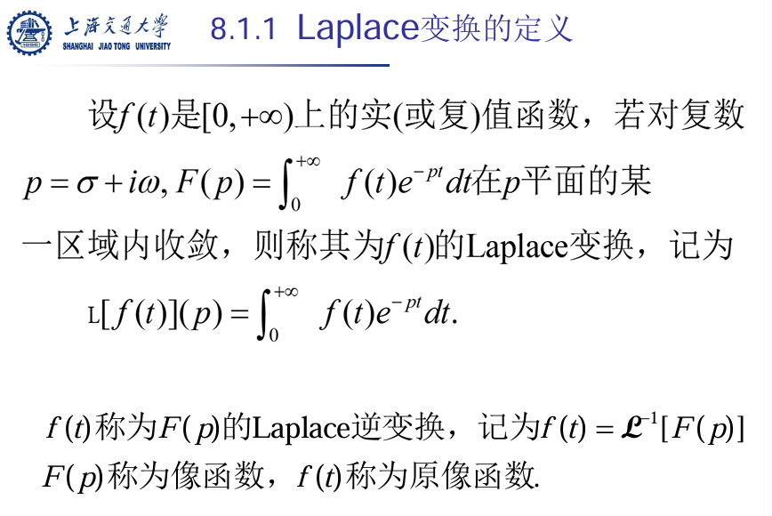
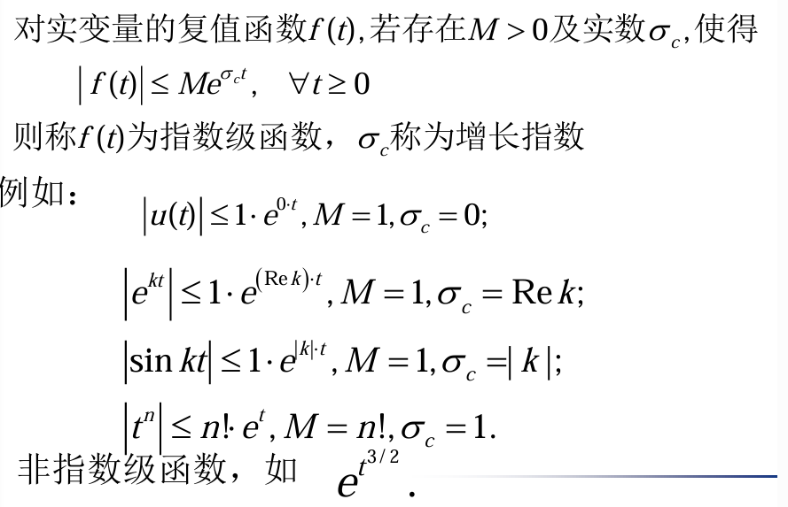
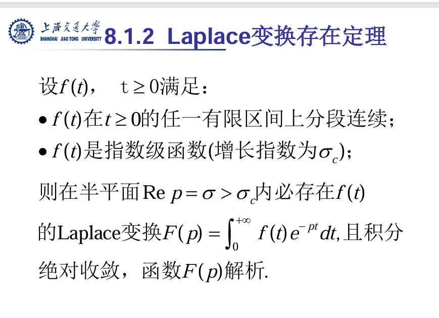
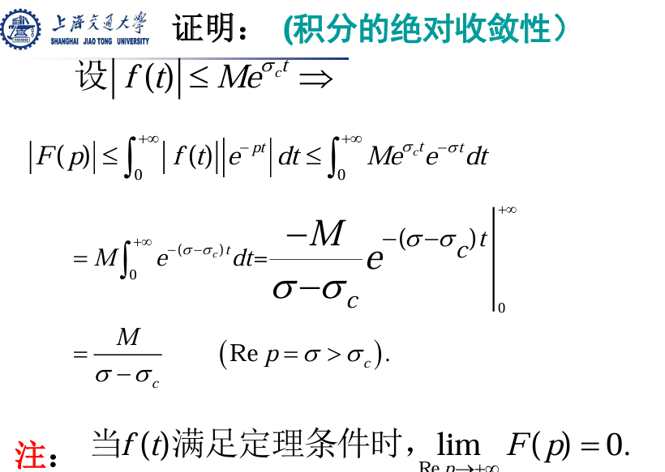

# Laplace变换

## \(\mathcal{L}[f(t)] = F(s) = \int_{0}^{\infty} f(t) e^{-st} dt\)

## 拉普拉斯收敛域

把\(s=\sigma + j\omega\) 代入 \(F(s) = \int_{0}^{\infty} e^{-at}e^{-st} dt\)，化简为
$F(s) = \int_{0}^{\infty} e^{-(a+\sigma)t}e^{-j\omega t} dt$

由于$e^{-j\omega t}$是旋转矢量，是周期函数，不影响收敛，
$\sigma > - a$是收敛域

## 指数级（指数阶）函数

## 导数的拉普拉斯变换

函数\(f(t)\)的导数的拉普拉斯变换是拉普拉斯变换理论中的一个重要性质。如果\(f(t)\)及其导数\(f'(t)\)都是分段光滑且指数阶的，那么\(f'(t)\)的拉普拉斯变换可以表示为：

$\mathcal{L}\{f'(t)\} = sF(s) - f(0^{+})$

推导过程(因为\(f(t\)是指数阶的，\(e^{-st}f(t)^{\infty} \to 0\))
$$
\begin{aligned}
\mathcal{L}[f'(t)] &= \int_{0}^{\infty} f'(t) e^{-st} dt \\
&= [e^{-st}f(t)]_0^{\infty} - \int_{0}^{\infty} (-se^{-st})f(t) dt \\
&= -f(0^{+}) + s \int_0^{\infty} e^{-st}f(t) dt \\
&= -f(0^{+}) + sF(s)
\end{aligned}
$$
