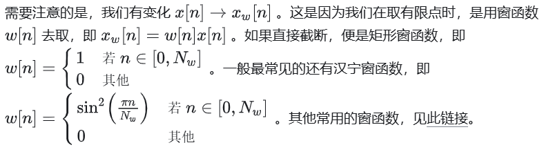
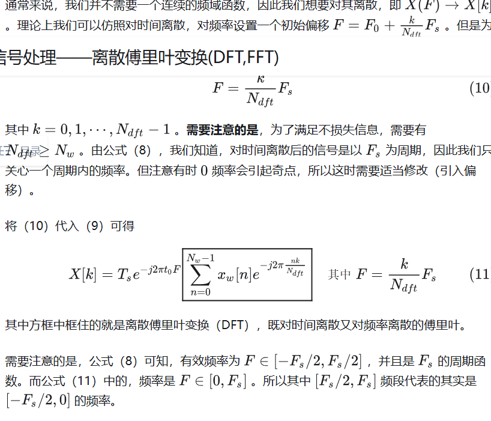

# 离散傅里叶变换(DFT)

## 表达式

$$X[k] = \sum_{n=0}^{N-1}x[n]e^{-j(2\pi /N)kn} $$
原信号\(x[n]\)
$$x[n] = \frac{1}{N}\sum_{n=0}^{N-1}X[k]e^{j(2\pi /N)kn} $$

## 一、DFT

### 1.1 离散时间傅里叶(DTFT)

连续傅里叶变换
\label{
$$
\begin{equation}
X(F) = \int_{-\infty}^{+\infty} x(t)e^{-j2\pi Ft} dt, \quad \forall F \in \mathbb{R}
\end{equation}
$$
}{eq 1}

现实信号采集和测量是离散信号(每\(T_s\)秒采集一次信号)，即\(x(t) \to x[n] \)，其中\(t=t_0+n\Delta t \)，因此\ref{eq 1}变为
$$
X(F) = \sum_{n=-\infty}^{+\infty} x[n]e^{-j2\pi F(t_0+n\Delta t)} \Delta t
$$
令采样间隔\(\Delta t = T_s\)，有
\label{
$$
\begin{equation}
X(F) = T_se^{-j2\pi Ft_0} \sum_{n=-\infty}^{+\infty} x[n]e^{-j2\pi FnT_s}
\end{equation}
$$
}{eq 2}

其中\(\sum_{n=-\infty}^{+\infty} x[n]e^{-j2\pi FnT_s}\)是离散时间傅里叶(DTFT)，只对时间离散的傅里叶。

但是采样率不当会使信号失真。对于周期信号来说，采样频率只有在大于2倍信号频率时才不会丢失频率信息，即
$$
F_s \ge 2F_0
$$

这就是香农采样定理。

指数衰减函数为
\label{
$$
\begin{equation}
x(t) = \begin{cases}
\exp(-\alpha t), & t \geq 0 \\
0, & t < 0
\end{cases}
\end{equation}
$$
}{eq 3}

将其代入\ref{eq 1}中，得到频域函数
\label{
$$
\begin{equation}
X(F) = \frac{1}{\alpha + j 2\pi F}
\end{equation}
$$
}{eq 4}

将\(x(t)\)离散，其采样频率为F_s(取\(t_0 = 0\))，\ref{eq 3}将变为
\label{
$$
\begin{equation}
x[n] = \begin{cases}
\exp(-\alpha T_s)^n, & t \geq 0 \\
0, & t < 0
\end{cases}
\end{equation}
$$
}{eq 5}

将\ref{eq 5}代入\ref{eq 2}得到
\label{
$$
\begin{equation}
X_s(F) = \frac{T_s}{1-e^{-\alpha T_s - j2\pi FT_s}}
\end{equation}
$$
}{eq 6}

### 1.2 窗函数

我们测量一个信号，不可能无限时间地去测量，因此时间是有限的，假设我们从\(t_0\)开始，一共测量\(N_w\)个点。所以\ref{eq 2}变为
\label{
$$
\begin{equation}
X(F) = T_se^{-j2\pi Ft_0}\sum_{n=0}^{N_w-1} x_w[n]e^{-j2\pi FnT_s}
\end{equation}
$$
}{eq 7}

### 1.3 DFT

