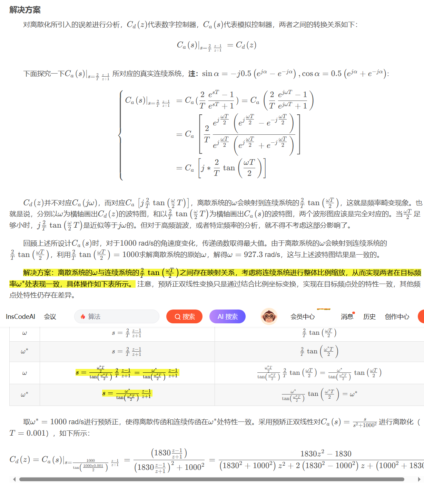

# 离散化方法

## 三大变换

### 傅里叶变换

$$
\begin{cases}
\begin{align*}
F(\omega) &= \int_{-\infty}^{\infty} f(t) e^{-j\omega t}dt \\
f(t) &= \frac{1}{2\pi} \int_{-\infty}^{\infty} F(\omega) e^{j\omega t}d\omega
\end{align*}
\end{cases}
$$

### 拉普拉斯变换(连续系统)

$$
\begin{cases}
\begin{align*}
F(s) &= \int_{-\infty}^{\infty} f(t) e^{-st}dt \\
f(t) &= \frac{1}{2\pi j} \int_{\sigma-j\infty}^{\sigma + j\infty} F(s) e^{st}d\omega
\end{align*}
\end{cases}
$$

### Z变换(离散系统)

$$
\begin{cases}
\begin{align*}
F(z) &= \sum f[n]z^{-n} \\
f[n] &= \frac{1}{2\pi j} \oint F(z) z^{n-1} dz
\end{align*}
\end{cases}
$$

### 映射转换

$$s=j\omega=\frac{1}{T}\ln z$$
$$z=e^{sT}=e^{j\omega T}$$

## 一、前向欧拉

$$
\begin{align*}
y'(k) &\approx \frac{y(k+1) - y(k)}{T} \\
\int_0^{\infty} y'(k) e^{-st} dt &\approx \frac{1}{T}\cdot(\sum y(k+1)z^{-k} - \sum y(k)z^{-k}) \\
sY(s) &\approx \frac{z-1}{T}Y(z)
\end{align*}
$$

由上可得
$$s=\frac{z-1}{T} \Leftrightarrow z=1+sT$$

## 二、后向欧拉

$$
\begin{align*}
y'(k) &\approx \frac{y(k) - y(k-1)}{T} \\
\int_0^{\infty} y'(k) e^{-st} dt &\approx \frac{1}{T}\cdot(\sum y(k)z^{-k} - \sum y(k-1)z^{-k}) \\
sY(s) &\approx \frac{1-z^{-1}}{T}Y(z)
\end{align*}
$$

由上可得
$$s=\frac{1-z^{-1}}{T} \Leftrightarrow z=\frac{1}{1-sT}$$

## 三、双线性变换（Tustin）

使用泰勒展开可得

$$
\begin{align*}
z &= e^{sT}\\
&= \frac{e^{sT/2}}{e^{-sT/2}}\\
&= \frac{1+sT/2}{1-sT/2}
\end{align*}
$$

由上可得
$$s=\frac{2}{T}\frac{1-z^{-1}}{1+z^{-1}} \Leftrightarrow z= \frac{1+sT/2}{1-sT/2}$$

## 四、预矫正双线性变换（Tustin with Pre-Warping）

